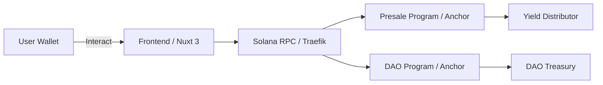

# S3MT 

## Table of Contents
- [Project Overview](#project-overview)
- [Key Features](#key-features)
- [Technology Stack](#technology-stack)
- [Architecture](#architecture)
- [Documentation](#documentation)
- [Tokenomics Summary](#tokenomics-summary)
- [Getting Started](#getting-started)
- [Contributing](#contributing)
- [License](#license)

## Project Overview


- **Institutional-grade custody** via decentralized price oracles
- **Presale mechanism** to bootstrap initial liquidity and community participation
- **On-chain yield distribution** from protocol fees and revenue streams
- **Burn-to-value** redemption allowing holders to redeem tokens for real-world value
- **DAO Governance** empowering token holders to propose and vote on protocol upgrades

## Key Features

- **Presale Smart Contract**: Anchor-based Solana program to manage token presale.
- **Yield Distributor**: Automatically distributes fees proportionally to token holders.
- **Redemption Mechanism**: Burn tokens for USD stablecoins or underlying assets.
- **DAO Module**: Governance framework for on-chain proposal and voting.
- **Oracle Integration**: Reliable price feeds from Chainlink or Pyth network.

## Technology Stack

- **Blockchain**: Solana
- **Smart Contracts**: Rust, Anchor framework
- **Frontend**: Nuxt 3 (Vue 3, TypeScript), Tailwind CSS
- **Wallet Integration**: @solana/wallet-adapter
- **Containerization**: Docker, Traefik, local Solana Validator
- **Build & Automation**: Node.js, Yarn, Makefile scripts

## Architecture



## Documentation

Comprehensive project documentation and whitepapers are located in the `docs/` directory:

- **Project Overview**: `docs/S3MT — Project Overview.docx`
- **Whitepaper (Goldpaper)**: `docs/S3MT - Goldpaper.pdf`
- **Tokenomics Model**: `docs/S3MT Tokenomics v1.1.docx`
- **Stack Selection Spec**: `docs/S3MT Smart Contract Stack Selection.pdf`
- **Presale Timeline & Milestones**: `docs/S3MT Presale Timeline & Key Milestones.docx`
- **ELI5 Objective**: `docs/S3MT - ELI5 Objective.docx`
- **Burn-to-Value Mechanism**: `docs/S3MT - Token Burn-to-Value Redemption Mechanism.docx`
- **Yield Distribution Mechanism**: `docs/S3MT - Yield Distribution Mechanism for Token Holders.docx`

## Tokenomics Summary

| Allocation                  | Percentage |
| --------------------------- | ---------- |
| Presale                     | 30%        |
| Liquidity & Market Making   | 20%        |
| DAO Treasury                | 15%        |
| Team & Advisors (vested)    | 15%        |
| Community & Airdrops        | 10%        |
| Yield & Rewards Pool        | 10%        |

> For a detailed breakdown of vesting schedules, lockup periods, and mechanisms, see `docs/S3MT Tokenomics v1.1.docx`.

## Getting Started

1. Clone the repository:  
   ```bash
   git clone https://github.com/your-org/s3mt.git
   cd s3mt
   ```
2. Install dependencies:  
   ```bash
   yarn install
   ```
3. Start the development server:  
   ```bash
   yarn dev
   ```
4. Build for production:  
   ```bash
   yarn build
   ```
5. Launch with Docker (optional):  
   ```bash
   make dev
   ```
6. Preview production build (optional):  
   ```bash
   yarn preview
   ```
   For more information on deployment, see the [Nuxt deployment documentation](https://nuxt.com/docs/getting-started/deployment).

## Makefile Commands

The S3MT project provides a Makefile to streamline common tasks related to Docker services, image builds, and one-off commands. Below is a summary of the most frequently used targets:

- `make dev [s=<service>]`          : Start the development environment for all services or a specific service.
- `make up [s=<service>]`           : Bring up Docker containers for all services or a specific service.
- `make down [s=<service>]`         : Stop and remove containers for all services or a specific service.
- `make start [s=<service>]`        : Start specific services defined in `tmp/start.txt`.
- `make stop [s=<service>]`         : Stop running containers without removing them.
- `make restart [s=<service>]`      : Restart containers for all services or a specific service.
- `make logs [s=<service>]`         : Tail logs for all services or a specific service.
- `make build s=<service> [tag=<tag>] [type=<type>]`: Build a Docker image for a service (default `type=base`).
- `make dbuild s=<service> [tag=<tag>]`: Build a Docker image with development proxy settings (`haproxy_dev.cfg`).
- `make rebuild s=<service>`        : Rebuild the main app image after code changes.
- `make recopy s=<service>`         : Copy updated files into a container without a full rebuild.
- `make run s=<service> cmd="<command>"`: Run a one-off command in a new container.
- `make exec s=<service> cmd="<command>"`: Execute a command in a running container.
- `make sh s=<service>`             : Open a shell in a running container.
- `make pull [s=<service>]`         : Pull the latest image for a service from the registry.
- `make reboot [s=<service>]`       : Alias for restarting services (stop & up).
- `make update [s=<service>]`       : Update services by pulling code and rebuilding images.
- `make import-vector [d=<dir>]`    : Initialize schema and populate vector DB from WordPress.
- `make programs`                   : Show installed Solana programs on the local validator.
- `make add-app s=<service>`        : Scaffold a new app in the project.

For a full list of available targets and detailed usage, run `make` without arguments or inspect the Makefile at the project root.

## Contributing

We welcome contributions from the community! Please follow these steps:

1. Fork the repository.
2. Create a new branch: `git checkout -b feature/your-feature`.
3. Commit your changes with clear messages: `git commit -m "feat: description"`.
4. Open a Pull Request and describe your work.

Refer to `CONTRIBUTING.md` (if available) or open issues to discuss ideas.

## License

This project is licensed under the MIT License.  
See [LICENSE](LICENSE) for details.

